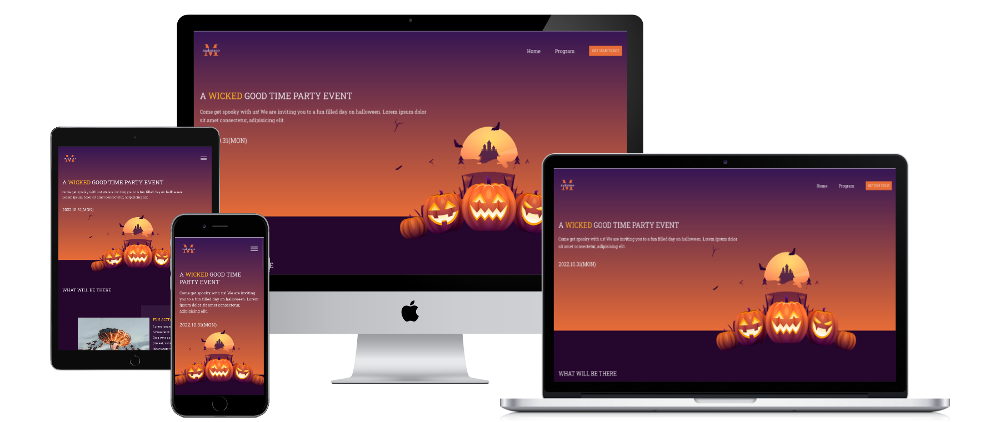

# Haloween-Event-Responsive

This is a halloween event website that seeks to master how to build responsive web design with only css and html

## Project Features

- Navigation menu
- Grid
- Form
- Footer

### Mock up



### 🔴 [LIVE LINK](https://halloween-event.netlify.app/)

<hr>

## Built With 🔨

- HTML
- CSS
- JavaScript(ES6)
- Github

## Setup

### Prerequisites

- IDE (VCode For me 🔥).

### Clone this repository

```bash
$ git clone https://github.com/jmoseka/Haloween-Event-Responsive.git
$ cd Haloween-Event-Responsive
```

### Open page in browser
```bash
$ open index.html
```

## Author

👤 **Jamila Moseka**

- GitHub: [@jmoseka](https://github.com/jmoseka)

## 🤝 Contributing

Contributions, issues and feature requests are welcome!

## Show your support

Give a ⭐️ if you like this project!

## Acknowledgments

- Hat tip to anyone whose code was used
- Inspiration
- etc

## 📝 License

This project is [MIT](./MIT.md) licensed.
